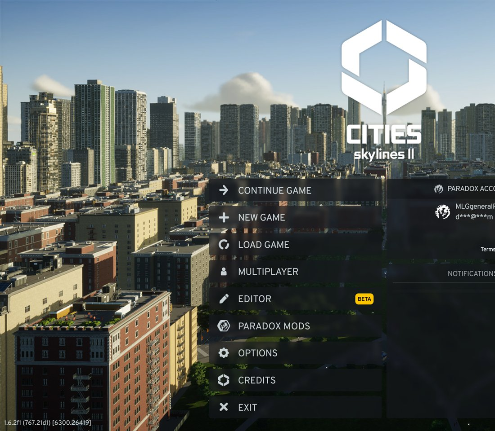
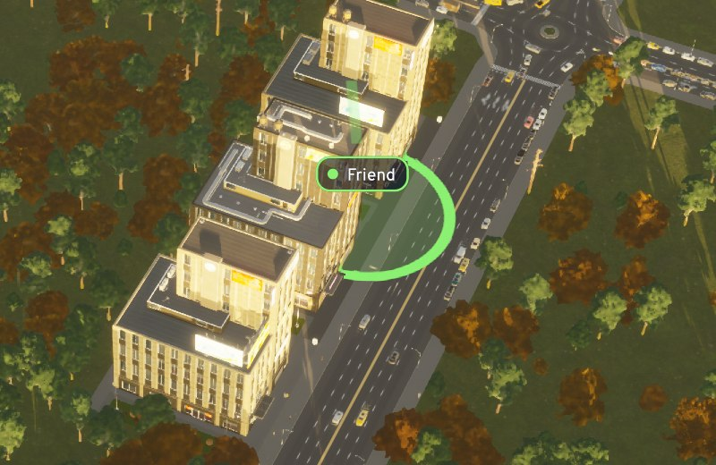
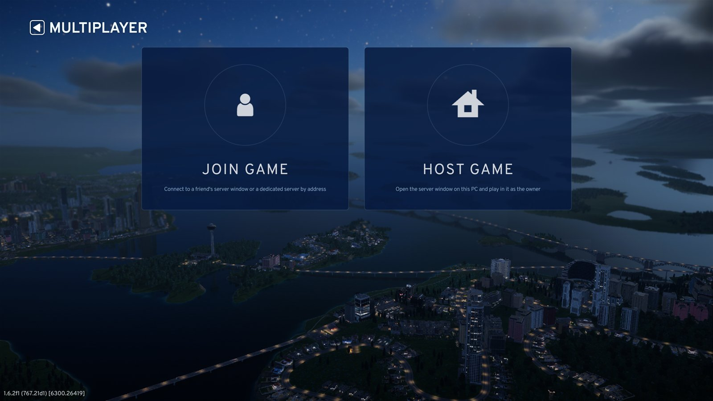
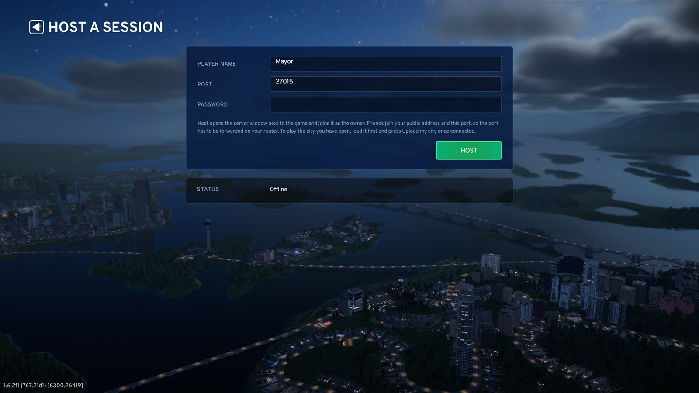
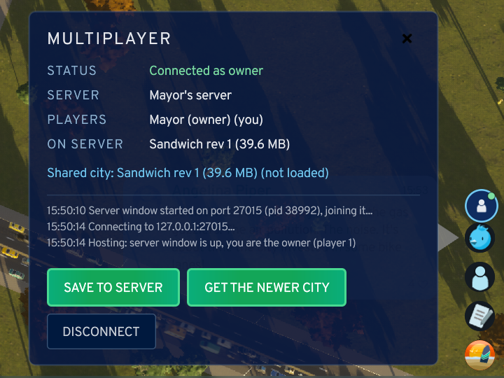
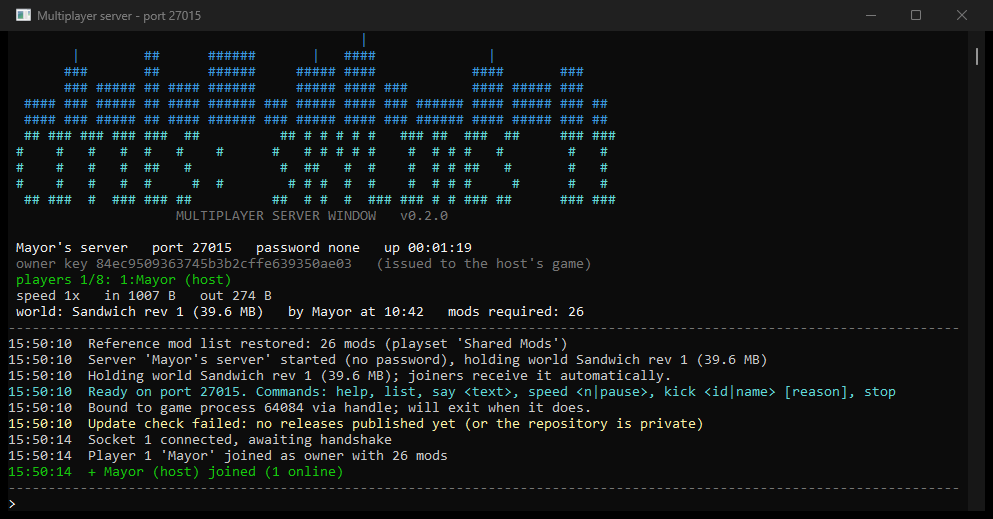

# Multiplayer for Cities: Skylines II

Play one city with friends. A small server program holds the city and passes everything around; the game talks to it through this mod. Host it from your own PC, or run the server on a box somewhere.



## What it does

- Roads, buildings, zoning, bulldozing, terrain, districts and transit lines you place show up on everyone's screen straight away.
- Taxes, budgets, service fees, city policies and building options sync too.
- Traffic Tool Essentials settings (junction signals, phases, lane groups, lane directions, labels, depot zones) follow whoever changes them, as long as everyone has the mod.
- You see where the others are: a ring on the map where each player is looking, a dot under their mouse, and their name over it.
- Anyone can save the city to the server. Whoever joins gets the latest copy and loads it.
- Any mods are fine as long as everyone runs the same playset. A server can follow a public Paradox playset and tell people exactly what they are missing.



The simulation itself still runs on each PC, so citizens and traffic are not identical everywhere. The money is: one player's balance is sent round every five seconds and everyone runs with it. For the rest, a save from anyone brings the others back to the same city, on request or automatically if you turn that on in the options.

## Playing

Install the mod from Paradox Mods, then Main menu > Multiplayer.



**Host game** opens the server window next to your game and joins it. Friends need your public address and the port (27015 unless you change it), so forward that port on your router.



**Join game** connects to a friend or to a dedicated server. Joining from the main menu downloads the shared city and loads it. The host enters the owner key as well; nobody else needs it.

In a city, the round button at the top of the right-hand stack opens the panel.



**Save to server** uploads the city you are playing. Anyone can. The host (or the longest-connected player when there is no host) also saves every 5 minutes on its own; Options > Multiplayer changes that, and has a switch to reload automatically whenever someone else saves. Nothing is saved to the server when you quit, so press it before you leave.

## The server window



This is what Host game starts. It shows who is on, the shared city and the last events, and takes commands: `list`, `say`, `speed`, `kick`, `version`, `stop`. It closes when the host's game does.

## Dedicated server

The same program runs on a Linux or Windows box without the game installed. Download `cs2-multiplayer-server-<platform>-<version>.zip` from [Releases](https://github.com/DillanStephenson/cs2-multiplayer/releases). On Ubuntu:

```bash
unzip cs2-multiplayer-server-linux-x64-*.zip -d /tmp/cs2mp
sudo bash /tmp/cs2mp/setup-vps.sh "<password>" "<owner-key>" "<server name>"
```

That installs it as a systemd service on port 27015. Every setting is in `/opt/cs2-multiplayer/server.json` (on Windows: `server.json` next to the program, see `server.example.json` in the zip). Edit it and save; the server picks the change up within ten seconds. Only port, owner key, game version and the data folder need a restart.

```json
{
  "name": "Our server",
  "port": 27015,
  "password": "secret",
  "ownerKey": "only-the-host-knows-this",
  "gameVersion": "1.6.2f1",
  "maxPlayers": 8,
  "modCheck": "names",
  "playsetId": 11843013,
  "requiredMods": [],
  "welcome": "Welcome! Save often."
}
```

`modCheck` is `names` (same mods as the host, any version), `strict` or `off`. `playsetId` makes the server follow a public Paradox playset; leave it 0 and fill `requiredMods` with mod ids (`"125342"`) for a fixed list, or leave both empty to take the list from the host when they join. Details in [deploy/vps/README.md](deploy/vps/README.md).

Whoever joins with the owner key is the host. The server checks GitHub for newer releases and says so in the console and to the host when it is behind.

## Mods and playsets

- Everyone needs the same mods. Version numbers may differ.
- Someone who is rejected is told what is missing and which playset to activate.
- Put your public playset id in the server's `server.json` (`playsetId`) and it follows it: publish a new version of the playset, and within five minutes the server tells the players what changed. When your own game differs from the published playset, the server tells you to publish.

## Building it yourself

The game's modding toolchain has to be installed (Options > Modding in the game). Then:

```bash
npm install --prefix Multiplayer.UI
dotnet build Multiplayer/Multiplayer.csproj
```

That builds the mod, the menu screens and the bundled server window, and drops everything into the game's Mods folder. `dotnet test Multiplayer.Tests` runs the networking tests without the game; `dotnet build Multiplayer.Server` builds just the server.

| Folder | What |
| --- | --- |
| `Multiplayer` | The mod: session, build sync, menu bindings |
| `Multiplayer.UI` | Menu screens and in-game panel (React) |
| `Multiplayer.Core` | Protocol, transport, session logic. Compiled into both the mod and the server |
| `Multiplayer.Server` | The server window / dedicated server |
| `Multiplayer.Tests` | Tests for the core |
| `Multiplayer.SmokeClient` | Console client for testing a server without a second game |
| `deploy/vps` | Linux install script and service |

## Status

Early. Tested with two players on one PC and against a VPS. Keep your own saves. Report problems in Issues.

Releasing: tag `vX.Y.Z` to get server builds attached to a GitHub release. The mod goes to Paradox Mods with `dotnet publish Multiplayer/Multiplayer.csproj -c Release -p:PublishProfile=PublishNewVersion` (text and version in `Multiplayer/Properties/PublishConfiguration.xml`).
